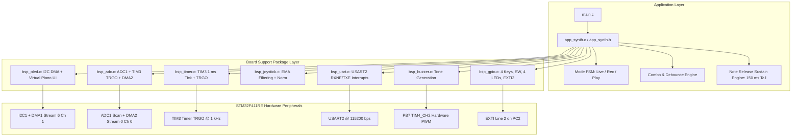

# STM32 Synthesizer & Sequencer Project - Architecture & AI Context Guide

> **Target Audience**: AI Coding Assistants, LLM Agents, Embedded Software Auditors.  
> **System Purpose**: Real-time 8-Voice Diatonic Synthesizer with Sequence Recorder, Hardware Sequencer, 1.30" I2C OLED Virtual Piano UI, Joystick Pitch Bender, Note Release Sustain Engine, and Zero-CPU ADC/I2C DMA Subsystems.  
> **Target MCU**: STMicroelectronics STM32F411RET6 (Nucleo-F411RE, ARM Cortex-M4F @ 16 MHz HSI default, FPU Enabled).  
> **Coding Standard**: 100% Compliant with the 22 Toyota Embedded MISRA-C Rules.

---

## 1. High-Level Architecture Overview

The firmware strictly adheres to a **Two-Tier Architecture**:
1. **Application Layer (`app_*`)**: Business logic, note translation, recording/playback finite state machine (FSM), key debounce & combo recognition, note release sustain engine, and UI rendering dispatch.
2. **Board Support Package / Driver Layer (`bsp_*`)**: Hardware abstraction layer directly manipulating STM32 CMSIS registers with zero HAL overhead, featuring non-blocking service slices and autonomous DMA/hardware interrupt handling.



---

## 2. Directory & File Manifest

| File Path | Layer | Role / Description & Public APIs |
|:---|:---|:---|
| [`Src/main.c`](file:///z:/Embedsystemtoyota/Project/Src/main.c) | Core | Entry point: enables Cortex-M4 hardware FPU coprocessor (`SCB->CPACR`), initializes all BSP modules, and executes the synthesizer application super-loop. |
| [`Src/app_synth.c`](file:///z:/Embedsystemtoyota/Project/Src/app_synth.c) | App | Synthesizer state machine: Note frequency tables (Octave 7-8), 64-step sequencer, note release sustain engine (150 ms decay tail), pitch bend + vibrato (Q12 ratio table), UART command parsing and telemetry, 4-key debounce, key combos (K1+K4 Record, K2+K3 Playback). |
| [`Inc/app_synth.h`](file:///z:/Embedsystemtoyota/Project/Inc/app_synth.h) | App | Public APIs: `app_synth_init(void)` and `app_synth_run(void)`. |
| [`Src/bsp_oled.c`](file:///z:/Embedsystemtoyota/Project/Src/bsp_oled.c) | BSP | 1.30" OLED (SH1106 / SSD1306) driver: 1024-byte framebuffer, 5x7 font, virtual piano UI, DMA1 Stream 6 transfer, bounded I2C waits (`oled_wait_set` / `oled_wait_clear`), 9-clock I2C bus recovery, 15 ms DMA stall watchdog, 3-error auto recovery, and 2000 ms keep-alive. Drawing primitives are file-private. |
| [`Inc/bsp_oled.h`](file:///z:/Embedsystemtoyota/Project/Inc/bsp_oled.h) | BSP | APIs: `bsp_oled_init(void)`, `bsp_oled_service(uint32_t u4t_now)`, `bsp_oled_clear_buffer(void)`, `bsp_oled_render_piano_keyboard()`, `bsp_oled_render_header()`, `bsp_oled_render_pitch_gauge()`. |
| [`Src/bsp_adc.c`](file:///z:/Embedsystemtoyota/Project/Src/bsp_adc.c) | BSP | ADC1 3-channel scan (PA4 Volume, PC0 VRx, PC1 VRy) triggered by TIM3 TRGO via DMA2 Stream 0 circular buffer (zero CPU polling). |
| [`Inc/bsp_adc.h`](file:///z:/Embedsystemtoyota/Project/Inc/bsp_adc.h) | BSP | APIs: `bsp_adc_init(void)`, `bsp_adc_get_raw(uint8_t u1t_idx)` with `ADC_IDX_VOLUME` / `ADC_IDX_JOY_X` / `ADC_IDX_JOY_Y`, `bsp_adc_get_volume_percent(void)`. |
| [`Src/bsp_joystick.c`](file:///z:/Embedsystemtoyota/Project/Src/bsp_joystick.c) | BSP | HW-504 Dual-Axis Joystick: Exponential Moving Average (EMA, $\alpha=0.25$) filter, fixed center (2048), deadzone window ($\pm 160$), normalized $[-1000..+1000]$ output, and switch debounce FSM with boot guard. |
| [`Inc/bsp_joystick.h`](file:///z:/Embedsystemtoyota/Project/Inc/bsp_joystick.h) | BSP | APIs: `bsp_joystick_service(uint32_t u4t_now)`, `bsp_joystick_get_norm_x(void)`, `bsp_joystick_get_norm_y(void)`, `bsp_joystick_get_event(void)`. |
| [`Src/bsp_timer.c`](file:///z:/Embedsystemtoyota/Project/Src/bsp_timer.c) | BSP | TIM3 hardware timer (1 kHz TRGO trigger) and non-blocking millisecond tick / microsecond delay utilities (`bsp_delay_us()`, `bsp_delay_ms()`). |
| [`Inc/bsp_timer.h`](file:///z:/Embedsystemtoyota/Project/Inc/bsp_timer.h) | BSP | APIs: `bsp_timer_init(void)`, `bsp_timer_get_ms(void)`, `bsp_delay_us(uint32_t u4t_us)`, `bsp_delay_ms(uint32_t u4t_ms)`. |
| [`Src/bsp_gpio.c`](file:///z:/Embedsystemtoyota/Project/Src/bsp_gpio.c) | BSP | GPIO initialization: 4 Keys (PA10, PB3, PB5, PB4), HW-504 SW (PC2), 4 LEDs (PA5 blue, PA6 red, PA7 yellow, PB6 green), and EXTI Line 2 interrupt on PC2 (Joystick SW). `bsp_gpio_read_keys()` checks each pin with `GPIO_IDR_IDx` (active low) and returns a `KEY_MASK_*` bitmask. All register setup uses CMSIS names (e.g. `GPIO_MODER_MODER5_0`, `SYSCFG_EXTICR1_EXTI2_PC`). |
| [`Inc/bsp_gpio.h`](file:///z:/Embedsystemtoyota/Project/Inc/bsp_gpio.h) | BSP | APIs: `bsp_gpio_init(void)`, `bsp_gpio_read_keys(void)`, `bsp_gpio_read_joystick_switch(void)`, `bsp_gpio_leds_set(uint8_t u1t_mask)` (bit n = LED of Key n+1: `LED_MASK_BLUE`, `LED_MASK_RED`, `LED_MASK_YELLOW`, `LED_MASK_GREEN`), `bsp_gpio_get_exti_flag()`, `bsp_gpio_clear_exti_flag()`. |
| [`Src/bsp_buzzer.c`](file:///z:/Embedsystemtoyota/Project/Src/bsp_buzzer.c) | BSP | Audio generation: PB7 Hardware PWM (TIM4_CH2) tone generation with quadratic volume pulse shaping. |
| [`Inc/bsp_buzzer.h`](file:///z:/Embedsystemtoyota/Project/Inc/bsp_buzzer.h) | BSP | APIs: `bsp_buzzer_init(void)`, `bsp_buzzer_set_tone(uint32_t u4t_freq_hz, uint16_t u2t_vol_adc)`, `bsp_buzzer_off(void)`. |
| [`Src/bsp_uart.c`](file:///z:/Embedsystemtoyota/Project/Src/bsp_uart.c) | BSP | USART2 driver: 115200 bps, 8-N-1, 100% Interrupt-Driven RX (RXNE ring buffer) & TX (TXE ring buffer), zero CPU polling. |
| [`Inc/bsp_uart.h`](file:///z:/Embedsystemtoyota/Project/Inc/bsp_uart.h) | BSP | APIs: `bsp_uart_init(void)`, `bsp_uart_send_string(const char *p_str)`, `bsp_uart_send_dec(uint32_t u4t_val)`, `bsp_uart_read_char(char *p_c)` (returns `false` when RX buffer is empty). |
| [`Inc/bsp_reg_fields.h`](file:///z:/Embedsystemtoyota/Project/Inc/bsp_reg_fields.h) | BSP | Shared register field values written in binary as the Reference Manual lists them (`GPIO_MODE_OUTPUT (0b01U)`, `GPIO_PULL_UP`, `GPIO_AF7_USART2 (0b0111U)`, `DMA_PRIORITY_HIGH`, ...). Used as `REG \|= (VALUE << FIELD_Pos)`. |
| [`STM32F411RETX_FLASH.ld`](file:///z:/Embedsystemtoyota/Project/STM32F411RETX_FLASH.ld) | Build | GNU Linker script: Flash memory (512 KB @ `0x08000000`), SRAM (128 KB @ `0x20000000`). |

---

## 3. Hardware Peripheral & Pinout Map

| Peripheral | Pin | Mode / Config | Hardware Subsystem & Functionality |
|:---|:---:|:---|:---|
| **I2C1_SCL** | **PB8** | AF4 (Open-Drain, Pull-Up, Very High Speed) | OLED Clock (Fast Mode ~380-400 kHz, 9-clock bus recovery) |
| **I2C1_SDA** | **PB9** | AF4 (Open-Drain, Pull-Up, Very High Speed) | OLED Data (DMA1 Stream 6 Channel 1, 129-byte page streaming) |
| **ADC1_IN4** | **PA4** | Analog Mode | Master Volume Potentiometer (0..4095 raw, TIM3 TRGO DMA2) |
| **ADC1_IN10** | **PC0** | Analog Mode | HW-504 Joystick VRx (Pitch Bend $\pm 200$ Cents, TIM3 TRGO DMA2) |
| **ADC1_IN11** | **PC1** | Analog Mode | HW-504 Joystick VRy (Down: High Bank, Up: Vibrato up to ±50 Cents, TIM3 TRGO DMA2) |
| **USART2_TX** | **PA2** | AF7 (Push-Pull, Very High Speed) | Serial Telemetry & UI status mirror @ 115200 bps |
| **USART2_RX** | **PA3** | AF7 (Pull-Up) | Serial Input Commands (RXNE Interrupt Ring Buffer) |
| **Key 1** | **PA10**| Input Pull-Up | Note 1 (DO / SOL) / Record Toggle Combo Key (with Key 4) |
| **Key 2** | **PB3** | Input Pull-Up | Note 2 (RE / LA) / Playback Toggle Combo Key (with Key 3) |
| **Key 3** | **PB5** | Input Pull-Up | Note 3 (MI / TI) / Playback Toggle Combo Key (with Key 2) |
| **Key 4** | **PB4** | Input Pull-Up | Note 4 (FA / HIGH DO) / Record Toggle Combo Key (with Key 1) |
| **Joy SW** | **PC2** | Input Pull-Up + EXTI2 Both Edges | HW-504 Center Push Switch: EXTI2 edge -> 30 ms debounce -> Short/Long click FSM |
| **Buzzer** | **PB7** | AF2 (TIM4_CH2, Push-Pull, High Speed) | Hardware PWM Audio Tone Generator with Quadratic Volume Duty Modulation |
| **Blue LED** (top) | **PA5** | Output Push-Pull | Live / Playback: Key 1 note sounding |
| **Red LED** | **PA6** | Output Push-Pull | Live / Playback: Key 2 note sounding · Recording: blinks every 200 ms |
| **Yellow LED** | **PA7** | Output Push-Pull | Live / Playback: Key 3 note sounding |
| **Green LED** (bottom) | **PB6** | Output Push-Pull | Live / Playback: Key 4 note sounding |

---

## 4. Subsystems & Key Technical Implementations

### 4.1. OLED Display Subsystem (DMA + Hardware Bus Recovery & Watchdog)
- **Framebuffer Architecture**: 1024 bytes (128 columns $\times$ 8 pages of 8 pixels each).
- **Zero-CPU Page Streaming**:
  - Transmits 1 page (129 bytes: 1 Control Byte `0x40` + 128 Data Bytes) per 5 ms timeslice using **DMA1 Stream 6 Channel 1**.
  - Frame refresh rate: ~25 FPS across 8 pages with zero CPU core blocking.
- **Hardware Bus Recovery (`oled_i2c_bus_recovery`)**:
  - Resolves **STM32F4 silicon errata 2.13.7** (`BUSY` bit lockup during I2C STOP/START transitions).
  - Toggles PB8/PB9 to GPIO Output Open-Drain and generates up to 9 clock pulses on SCL to force stuck I2C slave devices to release SDA.
  - Generates a manual bit-banged STOP condition on SDA/SCL.
  - Issues software reset via `I2C1->CR1 |= I2C_CR1_SWRST`, restores AF4 pin muxing, re-initializes CCR/TRISE registers, and flushes DMA status flags.
- **Bounded Waits & STOP Handshake**:
  - Every I2C/DMA flag wait goes through `oled_wait_set()` / `oled_wait_clear()` with a 10000-cycle timeout (`I2C_TIMEOUT_CYCLES`); START waits for `BUSY` to clear, STOP waits for `I2C_CR1_STOP` to clear.
  - Inserts a 5 µs idle guard delay (`I2C_IDLE_DELAY_US`) between consecutive transactions to satisfy I2C bus free time specifications ($t_{\text{BUF}}$).
- **DMA Interrupt Service Routine (`DMA1_Stream6_IRQHandler`)**:
  - Clears `CTCIF6` transfer complete flag.
  - Clears `I2C_CR2_DMAEN` **before** disabling the DMA stream to prevent spurious requests.
  - Waits for `I2C_SR1_BTF` (Byte Transfer Finished) with error flag monitoring (`AF` and `BERR`).
  - Generates hardware STOP condition and monitors `I2C_CR1_STOP` deassertion.
  - Clears any pending SR1 error flags and releases the DMA busy semaphore (`g_b_dma_busy = false`).
- **Periodic Keep-Alive & Hang Watchdog**:
  - Every 2000 ms (`OLED_KEEP_ALIVE_MS`), re-transmits Charge Pump Enable (`0x8D, 0x14` / `0xAD, 0x8B`) and Display ON (`0xAF`) commands to prevent sleep or charge-pump dropouts.
  - If a DMA transfer remains in progress longer than 15 ms (`OLED_DMA_TIMEOUT_MS`), the watchdog triggers full bus recovery.
  - If 3 consecutive errors occur (`OLED_MAX_ERRORS`), full recovery and display re-initialization are executed automatically.
- **Named UI Layout Constants**:
  - Volume Bar: `VOL_BAR_X0 (96U)`, `VOL_BAR_X1 (126U)`, rows 1..6, `VOL_BAR_MAX_LEN (28U)`.
  - Pitch Gauge: `GAUGE_X0 (40U)`, `GAUGE_X1 (88U)`, `GAUGE_Y0 (18U)`, `GAUGE_Y1 (22U)`, `GAUGE_CENTER_X (64)`, `GAUGE_HALF_TRAVEL (20)`.
  - Piano: 8 white keys x 16 px (rows 24..63), 5 black keys (rows 25..44); the active key is inverted with a page-byte stride fill (pages 3..7).

---

### 4.2. ADC & TIM3 TRGO Autonomous Sampling Subsystem
- **Zero CPU Overhead**: TIM3 runs at 1 kHz and generates a Master Mode TRGO update event on counter overflow.
- **Scan Sequence**: ADC1 regular group scans Rank 1 (PA4 Volume), Rank 2 (PC0 VRx), Rank 3 (PC1 VRy) on each TRGO event.
- **Circular DMA Transfer**: **DMA2 Stream 0 Channel 0** continuously transfers all 3 conversions directly into SRAM buffer `g_u2t_adc_dma_buffer[3]` in circular mode without software triggers. Consumers read the latest sample with `bsp_adc_get_raw(idx)`; no ADC flag is ever polled.

---

### 4.3. Synthesizer, Note Release Sustain & Sequencer Engine (`app_synth.c`)
- **Note Pitch Tables**: High Octave Diatonic (Octave 7-8):
  - C7 (2093 Hz), D7 (2349 Hz), E7 (2637 Hz), F7 (2794 Hz), G7 (3136 Hz), A7 (3520 Hz), B7 (3951 Hz), C8 (4186 Hz).
- **Bank Select**:
  - Joystick Y Center/Up (`VRy > -350`): Low Bank (C7, D7, E7, F7).
  - Joystick Y Down (`VRy <= -350`): High Bank (G7, A7, B7, C8).
- **Note Release Sustain Engine (`NOTE_SUSTAIN_MS = 150U`)**:
  - **Acoustic Decay Simulation**: When a physical key or UART note is released, the synthesizer sustains tone playback for 150 ms instead of cutting off immediately, creating a smooth natural sound.
  - **Monophonic Legato Transition**: When transitioning between notes, pressing a new key immediately preempts the active sustain window with zero latency.
  - **Combo Safety**: Pressing combo chords (K1+K4 or K2+K3) or stopping/starting playback instantly clears the sustain window, preventing stuck notes during mode transitions.
  - **Visual Synchronization**: The OLED virtual piano active key highlight and the key LED (live mode) remain illuminated throughout the sustain window for complete sensory feedback.
- **Pitch Bend & Vibrato**: Joystick X bends ±200 cents; Joystick Y up adds a 200 ms triangle-LFO vibrato up to ±50 cents. The sum is clamped to ±250 cents and converted with the 21-point Q12 ratio table `PITCH_RATIO_Q12` (25-cent steps, linear interpolation).
- **Mode FSM** (`synth_set_mode()` leaves the old mode cleanly, then enters the new one; `synth_toggle_mode()` wraps it):
  - Modes: `MODE_LIVE`, `MODE_RECORDING`, `MODE_PLAYING`.
  - Step Capacity: Up to 64 steps, recording note index, active duration (ms), and rest gap (ms).
  - Minimum note duration: 50 ms; minimum rest gap: 40 ms; max rest gap: 3000 ms.
  - **Continuous Looping Playback**:
    - When `RECORDER_PLAYING` reaches the end of the sequence (`g_u2t_play_step` wraps modulo `g_u2t_seq_count`), it seamlessly loops back to Step 0 and logs `[PLAYBACK] Loop restart...`.
    - Loops indefinitely until the user explicitly exits the mode via:
      1. **Breadboard Combo**: Press and hold Key 2 + Key 3 for 600 ms.
      2. **Joystick SW**: Short click on the HW-504 center button.
      3. **Serial Command**: Send `'p'` or `'P'` over USART2.
      4. **Switch to Record**: Press K1+K4 combo or send `'r'`/`'R'`.
- **UART Interactive Protocol**:
  - `'1'..'8'`: Trigger note directly with 300 ms gate duration.
  - `'r' / 'R'`: Toggle Recording mode.
  - `'p' / 'P'`: Toggle Playback mode.
  - `'c' / 'C'`: Return to live mode (saving any recording) and clear sequence memory.
  - `'?'`: Display interactive help menu.
- **UART Telemetry**: `[KEY] Playing`, `[CMD] Trigger`, `[RECORDER] Recording Started! / Recorded / Stopped & Saved`, `[PLAYBACK] Looping / Playing / Loop restart / Stopped!`. Every note line uses one format: `C7 (DO) (2093 Hz, 300 ms)` (duration omitted for live keys), `[RECORDER] Memory cleared!`.

---

### 4.4. Joystick Driver & Exponential Moving Average (EMA) Filtering (`bsp_joystick.c`)
- **Analog Filtering**: First-order Exponential Moving Average (EMA) filter applied to raw 12-bit ADC inputs:
  $$\text{EMA}_{k} = \frac{3 \cdot \text{EMA}_{k-1} + \text{ADC}_{\text{raw}}}{4} \quad (\alpha = 0.25)$$
  Implemented with named constants `JOY_EMA_WEIGHT_PREV (3U)` and `JOY_EMA_WEIGHT_DIV (4U)`.
- **Deadband & Center Calibration**:
  - Theoretical center: 2048 counts (`JOY_CENTER_VAL`).
  - Deadzone window: $\pm 160$ counts (`JOY_DEADZONE_COUNTS`).
  - Output: Normalized linearly to range $[-1000..+1000]$ (`JOY_NORM_MAX`).
- **Switch Debounce FSM**:
  - 30 ms debounce filter (`SW_DEBOUNCE_MS`).
  - Boot guard: the switch state starts as "pressed, long press already reported", so a switch held (or stuck) at power-up never fires an event.
  - 600 ms hold threshold (`SW_HOLD_MS`) distinguishing short clicks (`JOY_SW_EVT_SHORT_PRESS`) from long presses (`JOY_SW_EVT_LONG_PRESS`).

---

### 4.5. Audio Generation Subsystem (`bsp_buzzer.c`)
- **Tone Generation**: Hardware PWM on PB7 using TIM4 Channel 2 (AF2) with zero CPU overhead.
- **Volume Shaping**: Potentiometer ADC (0..4095) scales the high-pulse duty cycle duration, modulating acoustic volume without altering pitch frequency.
- **Pitch**: The buzzer only receives a final frequency; pitch bend and vibrato are computed in `app_synth.c` (see 4.3).

---

## 5. Toyota Embedded MISRA-C Compliance Guidelines

All source code strictly complies with the 22 Toyota Embedded MISRA-C rules:

1. **Comment Style**: Block `/* ... */` comments only. Single-line `//` comments are strictly prohibited.
2. **Brace Placement**: Opening `{` and closing `}` must be on their own separate lines. (Exception: `} else {` on the same line).
3. **Spacing**: Exactly one space between operators and operands (e.g., `a = (b + c) / d;`).
4. **Statements**: Exactly one statement per line. No comma-separated statements.
5. **No Magic Numbers**: All numeric constants must be defined via `#define` or `const` with explicit `U` or `UL` suffixes.
6. **No Ternary Operator**: The `? :` conditional operator is strictly banned. Use full `if (...) { ... } else { ... }` blocks.
7. **No Dead Code**: Zero unused variables, uncalled local functions, or unreachable branches.
8. **Numeric Literals**: Octal literals are forbidden. All unsigned literals must end with `U` or `UL` (e.g., `100U`, `0x8000UL`).
9. **Function Prototypes**: Every parameter must be explicitly named. Functions taking zero arguments must be declared as `(void)`.
10. **Initialization**: All automatic local variables must be initialized at their declaration.
11. **Control Flow Rules**:
    - Every `if`, `else`, `while`, and `for` body must be enclosed in braces `{ ... }`.
    - Every `if` (single `if` and `if ... else if` chains) must terminate with an explicit `else` branch (containing `/* No action required */` if empty).
    - Every non-empty `switch` `case` must terminate with an unconditional `break`.
    - Every `switch` statement must feature a mandatory `default:` clause positioned at the top or bottom.
12. **Hungarian Notation**:
    - `u1t_`: `uint8_t`
    - `u2t_`: `uint16_t`
    - `u4t_`: `uint32_t`
    - `s1t_`: `int8_t`
    - `s2t_`: `int16_t`
    - `s4t_`: `int32_t`
    - `b_`: `bool`
    - `c_`: `char`
    - `g_`: Global / File-scope static variable
    - `p_`: Pointer variable

---

## 6. Build & Toolchain Information

- **Compiler**: ARM GNU Toolchain GCC v13.3.rel1 (`arm-none-eabi-gcc`).
- **Compiler Flags** (STM32CubeIDE Debug makefile): `-mcpu=cortex-m4 -mthumb -mfpu=fpv4-sp-d16 -mfloat-abi=hard -std=gnu11 -O0 -g3 -Wall`.
- **Build Result**: 0 errors, 0 compiler warnings. The linker prints 4 newlib notes (`_close/_lseek/_read/_write is not implemented`) from `--specs=nosys.specs`; these are expected.
- **Target Linker Script**: `STM32F411RETX_FLASH.ld`.
- **Target Output Binary**: `Debug/Project.elf`.
- **Memory Footprint**:
  - **Flash (Text + Data)**: ~11 KB / 512 KB (~2.2% utilization).
  - **RAM (BSS + Data)**: ~3.6 KB / 128 KB (~2.8% utilization).
- **Build Verification**:
  ```powershell
  # Compile from Debug directory:
  make -j4 all
  ```

---

## 7. Guidelines for AI Assistants & Autonomous Agents

When modifying or refactoring this codebase, any AI agent must adhere to the following rules:
1. **Never introduce `//` single-line comments**; always use `/* comment */`.
2. **Never leave any `if` without a closing `else` branch** (Toyota Rule 19 as defined in the course skill file).
3. **Always apply Hungarian notation** to all newly declared variables, pointers, and function parameters.
4. **Never introduce blocking delays** in any `bsp_*_service()` or `app_*_run()` service slices; use `u4t_now - u4t_last_ms >= INTERVAL` timestamping.
5. **Always preserve I2C bus recovery protections** whenever touching `Src/bsp_oled.c`.
6. **Ensure zero compiler warnings** with the project's `-Wall` build.
7. **Never poll UART or ADC status registers**; UART is RXNE/TXE interrupt + ring buffers, ADC is TIM3 TRGO + DMA2 circular.
