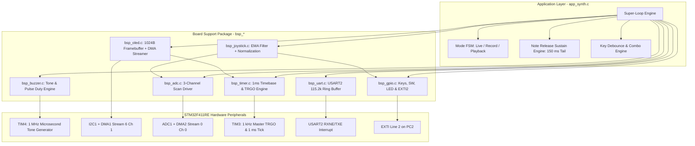

# STM32F411RE Real-Time Synthesizer & Hardware Sequencer

[-blue.svg)](https://www.st.com/en/evaluation-tools/nucleo-f411re.html)
[]()

A bare-metal **Real-Time Monophonic 8-Note Diatonic Synthesizer and 64-Step Hardware Sequencer** developed for the **STMicroelectronics STM32F411RET6** (Nucleo-F411RE, ARM Cortex-M4F @ 16 MHz). 

Built without heavy vendor HAL libraries using direct CMSIS register manipulation, featuring autonomous **Zero-CPU DMA subsystems**, hardware-PWM audio, a 100% interrupt-driven UART console, and a real-time 1.30" I2C OLED virtual piano interface.

---

## Key Highlights

- **8-Note High Diatonic Synthesizer (monophonic)**: Generates octave 7–8 notes (C7 to C8: 2093 Hz – 4186 Hz) on TIM4 hardware PWM with 1 µs period resolution.
- **64-Step Sequence Recorder & Looper**: Records notes, active durations, and rest gaps with seamless infinite looping playback.
- **Note Release Sustain Engine**: Features a 150 ms acoustic decay tail upon note release and zero-latency monophonic legato preemption.
- **Dual-Axis Analog Joystick Controls**:
  - **Pitch Bend**: Smooth $\pm 200$ Cents modulation using a 21-point Q12 ratio lookup table with linear interpolation.
  - **Vibrato**: Pushing VRy up adds a 200 ms triangle LFO vibrato of up to $\pm 50$ Cents (bend + vibrato clamped to $\pm 250$ Cents).
  - **Octave Bank Switching**: Pushing VRy down switches from Low Bank (C7–F7) to High Bank (G7–C8).
  - **Center Switch**: 30 ms debounce; short click toggles playback (or stops recording), 600 ms long press toggles recording. A switch held at power-up is ignored.
- **1.30" I2C OLED Virtual Piano UI (SH1106 / SSD1306)**:
  - 1024-byte framebuffer with real-time piano key highlights, pitch deviation gauge, and volume bar.
  - UI redrawn every 30 ms; non-blocking DMA streaming of one page (129 bytes) every 5 ms, a full 8-page frame every 40 ms (~25 FPS).
  - I2C bus recovery (up to 9 bit-banged SCL pulses + manual STOP + I2C1 software reset), 15 ms DMA stall watchdog, recovery after 3 consecutive errors, and a 2 s display keep-alive.
- **Autonomous Zero-CPU ADC Subsystem**:
  - TIM3 TRGO hardware trigger (1 kHz) scans Volume Potentiometer (PA4), Joystick VRx (PC0), and VRy (PC1).
  - DMA2 Stream 0 circular buffer feeds SRAM directly without CPU polling.
- **Serial Interactive Console**:
  - USART2 @ 115,200 bps, 100% interrupt-driven: 64-byte RX ring buffer (`RXNE`) and 256-byte TX ring buffer (`TXE`), zero polling.
  - Supports remote piano keyboard input (`'1'`–`'8'`), recording / playback controls, and per-note telemetry.

---

## System Architecture

The firmware enforces a strict **Two-Tier Architecture**:
1. **Application Layer (`app_*`)**: Sequencer Finite State Machine (FSM), key debounce & combo detection, note release sustain engine, and UI dispatching.
2. **Board Support Package / Driver Layer (`bsp_*`)**: Hardware drivers directly manipulating STM32 CMSIS registers with non-blocking service slices and autonomous DMA/hardware interrupt routines.



---

## Hardware Pinout & Wiring

| Peripheral / Signal | Pin | Mode / Configuration | Hardware Subsystem Function |
| :--- | :---: | :--- | :--- |
| **I2C1_SCL** | **PB8** | AF4 (Open-Drain, Pull-Up, Very High Speed) | 1.30" OLED Clock (~380–400 kHz Fast Mode) |
| **I2C1_SDA** | **PB9** | AF4 (Open-Drain, Pull-Up, Very High Speed) | 1.30" OLED Data (DMA1 Stream 6 Channel 1) |
| **ADC1_IN4** | **PA4** | Analog Mode | Master Volume Potentiometer (0–4095 raw) |
| **ADC1_IN10** | **PC0** | Analog Mode | HW-504 Joystick VRx (Pitch Bend $\pm 200$ Cents) |
| **ADC1_IN11** | **PC1** | Analog Mode | HW-504 Joystick VRy (Down: High Bank, Up: Vibrato) |
| **USART2_TX** | **PA2** | AF7 (Push-Pull, Pull-Up, Very High Speed) | Serial Telemetry & Console @ 115,200 bps |
| **USART2_RX** | **PA3** | AF7 (Pull-Up, Very High Speed) | Serial Remote Commands (RXNE Interrupt) |
| **Key 1** | **PA10** | Input Pull-Up | Note 1 (DO / SOL) & Record Combo Key |
| **Key 2** | **PB3** | Input Pull-Up | Note 2 (RE / LA) & Playback Combo Key |
| **Key 3** | **PB5** | Input Pull-Up | Note 3 (MI / TI) & Playback Combo Key |
| **Key 4** | **PB4** | Input Pull-Up | Note 4 (FA / HIGH DO) & Record Combo Key |
| **Joystick SW** | **PC2** | Input Pull-Up + EXTI2 Falling Edge | HW-504 Center Push Switch (Short/Long click) |
| **Buzzer Out** | **PB7** | AF2 (TIM4_CH2, Push-Pull, Very High Speed) | Hardware PWM Audio Output with Quadratic Volume Pulse Shaping |
| **Red LED** | **PA6** | Output Push-Pull | On while a note sounds (incl. sustain tail), blinks every 200 ms while recording |

---

## Interrupt & DMA Priority Matrix

To ensure zero audio glitching and eliminate CPU stalls, interrupts are strictly prioritized:

| Vector | ISR Handler | Priority | Trigger Source | Functionality |
| :--- | :--- | :---: | :--- | :--- |
| **`DMA1_Stream6_IRQn`** | `DMA1_Stream6_IRQHandler` | **2** | DMA1 Transfer Complete | Releases I2C DMA lock, halts DMA, issues hardware STOP condition. |
| **`USART2_IRQn`** | `USART2_IRQHandler` | **2** | USART2 `RXNE` / `TXE` | RX: pushes bytes into a 64-byte ring buffer. TX: drains a 256-byte ring buffer, disables `TXEIE` when empty. |
| **`EXTI2_IRQn`** | `EXTI2_IRQHandler` | **2** | PC2 Falling Edge | Latches Joystick SW press event flag for the main application loop. |
| **`TIM3_IRQn`** | `TIM3_IRQHandler` | **3** | TIM3 Update (1 kHz) | Increments system millisecond counter `g_u4t_system_ms`. |
| *DMA2 Stream 0* | *(No Interrupt)* | — | TIM3 TRGO Pulse | **Circular Mode**: Transfers 3 ADC conversions directly into SRAM. |
| *TIM4 Channel 2* | *(No Interrupt)* | — | Hardware Counter | **Hardware PWM**: Autonomous square-wave audio on PB7 (Zero-CPU). |

---

## Operating Instructions

### 1. Playing Notes (Live Synthesizer Mode)
- **Keys 1 to 4**: Triggers notes in the active octave bank.
- **Octave Bank Switching (Joystick VRy)**:
  - **Center / Up** (`VRy > -350`): **Low Bank** $\rightarrow$ C7 (2093 Hz), D7 (2349 Hz), E7 (2637 Hz), F7 (2794 Hz).
  - **Down** (`VRy <= -350`): **High Bank** $\rightarrow$ G7 (3136 Hz), A7 (3520 Hz), B7 (3951 Hz), C8 (4186 Hz).
- **Pitch Bending (Joystick VRx)**:
  - Push Left/Right to bend pitch continuously by up to $\pm 200$ Cents.
- **Vibrato (Joystick VRy Up)**: Depth grows with stick travel, up to $\pm 50$ Cents.
- **Volume (PA4 Potentiometer)**: 0–100 %; the bottom ~2 % of travel mutes.
- **Sustain**: A released note keeps sounding for 150 ms.

### 2. Sequence Recording & Looping Playback
- **Toggle Recording Mode**:
  - **Hardware Combo**: Press and hold **Key 1 + Key 4** for 600 ms.
  - **Joystick**: Long-press center switch for 600 ms.
  - **UART**: Send `'r'` or `'R'`.
  - *Feedback*: Red LED blinks every 200 ms; start/stop chirps; each recorded note is logged to UART. Recording stops automatically at 64 steps.
- **Toggle Playback Mode**:
  - **Hardware Combo**: Press and hold **Key 2 + Key 3** for 600 ms.
  - **Joystick**: Short-click center switch.
  - **UART**: Send `'p'` or `'P'`.
  - *Behavior*: Plays recorded steps and **seamlessly loops back to step 0** indefinitely until stopped. Starting playback while recording saves the recording first; with an empty memory a low C4 beep is played instead.
- **Clear Sequence**:
  - Send `'c'` or `'C'` via UART (returns to live mode first, saving any recording in progress).

### 3. UART Console Protocol (115,200 bps, 8-N-1)
Connect a serial terminal (PuTTY, Tera Term, minicom) to the Nucleo Virtual COM port:
- `'1'` to `'8'`: Trigger note C7 through C8 remotely (300 ms gate duration).
- `'r'` / `'R'`: Toggle Recording mode.
- `'p'` / `'P'`: Toggle Playback mode.
- `'c'` / `'C'`: Clear sequence memory.
- `'?'`: Print the help menu.

Example telemetry (every note uses the same format):
```
[KEY] Playing: C7 (DO) (2093 Hz)
[RECORDER] Recording Started!
[RECORDER] Recorded: C7 (DO) (2093 Hz, 320 ms)
[RECORDER] Stopped & Saved! Total steps: 1
[PLAYBACK] Looping 1 notes (Press K2+K3, Joy SW, or 'p' to stop)...
[PLAYBACK] Playing: C7 (DO) (2093 Hz, 320 ms)
[PLAYBACK] Loop restart...
```

---

## Project Structure

```
├── Inc/
│   ├── app_synth.h        # Synthesizer FSM & sequencer declarations
│   ├── bsp_adc.h          # 3-Channel ADC & DMA2 driver interface
│   ├── bsp_buzzer.h       # Audio pulse shaper & tone engine interface
│   ├── bsp_gpio.h         # GPIO pin configurations & EXTI2 interface
│   ├── bsp_joystick.h     # HW-504 EMA filter & debounce FSM interface
│   ├── bsp_oled.h         # OLED graphics, virtual piano & I2C DMA interface
│   ├── bsp_timer.h        # TIM3 timebase & delay utilities
│   └── bsp_uart.h         # USART2 interrupt-driven ring buffer interface
├── Src/
│   ├── main.c             # System entry point & FPU coprocessor init
│   ├── app_synth.c        # Synthesizer application logic & sequencer FSM
│   ├── bsp_adc.c          # ADC1 + TIM3 TRGO + DMA2 circular engine
│   ├── bsp_buzzer.c       # Hardware PWM tone & volume pulse shaper (PB7 / TIM4_CH2)
│   ├── bsp_gpio.c         # GPIO setup, LED control & EXTI2 ISR
│   ├── bsp_joystick.c     # Joystick EMA filtering, deadzone & switch FSM
│   ├── bsp_oled.c         # 1024B Framebuffer, I2C1 bus recovery & DMA ISR
│   ├── bsp_timer.c        # TIM3 1ms tick & microsecond delays
│   ├── bsp_uart.c         # USART2 RXNE/TXE interrupt driver & ring buffers
│   ├── syscalls.c         # Newlib system call stubs (STM32CubeIDE generated)
│   └── sysmem.c           # _sbrk heap implementation (STM32CubeIDE generated)
├── .agents/skills/toyota-misra-c/  # MISRA-C rule guide & audit_misra.py static checker
├── Debug/                 # Generated by STM32CubeIDE: makefiles & build output (git-ignored)
├── Startup/
│   └── startup_stm32f411retx.s  # Vector table & reset handler
├── Manual/                # Datasheet, reference manual (RM0383) & Nucleo user manual
├── STM32F411RETX_FLASH.ld # Linker script (Flash: 512KB, SRAM: 128KB)
├── STM32F411RETX_RAM.ld   # Linker script variant for running from RAM
├── Project Debug.launch   # STM32CubeIDE debug / flash launch configuration
├── PROJECT_STRUCTURE.md   # Detailed architecture & API reference
├── CLAUDE.md              # Project context & rules for AI coding assistants
├── AGENT_HANDOVER.md      # Development history & handover notes
└── README.md
```

---

## Build & Flash

### Prerequisites
- **Toolchain**: GNU Tools for STM32 13.3.rel1 (`arm-none-eabi-gcc`, bundled with STM32CubeIDE 1.19)
- **Build System**: GNU Make (STM32CubeIDE-generated makefiles in `Debug/`)
- **CMSIS headers (not in this repo)**: [CMSIS 5](https://github.com/ARM-software/CMSIS_5) Core and [cmsis-device-f4](https://github.com/STMicroelectronics/cmsis-device-f4). `.cproject` expects them at `Z:\Embedsystemtoyota\CMSIS` and `Z:\Embedsystemtoyota\CMSIS-DEVICE-F4` (sibling folders of this project); update the include paths in project properties if you place them elsewhere.
- **Debugger / Programmer**: ST-Link v2-1 (integrated on Nucleo-F411RE)

### Building
`Debug/` is git-ignored, so on a fresh clone build once in STM32CubeIDE (*Project → Build*), which generates the makefiles. After that the command line works:

```bash
# Navigate to Debug directory
cd Debug

# Compile all source files
make -j4 all
```

Expected result: 0 errors, 0 compiler warnings. The linker prints 4 notes (`_close/_lseek/_read/_write is not implemented`) from newlib `nosys.specs`; these are expected.

### Flashing
- **STM32CubeIDE**: Open the project and run the `Project Debug` launch configuration (Run / Debug) to flash `Debug/Project.elf` via the on-board ST-Link.
- **STM32CubeProgrammer**: Connect via ST-LINK (SWD) and program `Debug/Project.elf`.
- Open a serial terminal on the Nucleo Virtual COM port at 115,200 bps (8-N-1) to see the console.

### MISRA Audit
```bash
python .agents/skills/toyota-misra-c/scripts/audit_misra.py Src/main.c Src/app_synth.c Src/bsp_*.c
```

### Compiler Flags
The STM32CubeIDE Debug configuration compiles with:
```bash
-mcpu=cortex-m4 -mthumb -mfpu=fpv4-sp-d16 -mfloat-abi=hard -std=gnu11 -O0 -g3 -Wall
```

---

## Toyota MISRA-C Compliance

All application and BSP sources follow the **22 Toyota Embedded MISRA-C rules**, checked with `.agents/skills/toyota-misra-c/scripts/audit_misra.py`:
- **Zero single-line comments**: Enforces standard `/* ... */` block comments exclusively.
- **Strict Brace Discipline**: Opening and closing braces on their own separate lines.
- **Named Constants**: Pins, timings, register values and limits use `#define` with typed suffixes (`U`, `UL`); all unsigned literals carry a `U`/`UL` suffix.
- **No Ternary Operator**: The `? :` construct is completely banned in favor of explicit `if / else`.
- **Complete Branch Coverage**: All `if ... else if` chains terminate with an explicit `else` block (the code uses no `switch` statements).
- **Strict Hungarian Notation**: Variables prefixed by type (`u1t_`, `u2t_`, `u4t_`, `s1t_`, `s2t_`, `s4t_`, `b_`, `c_`, `g_`, `p_`).
